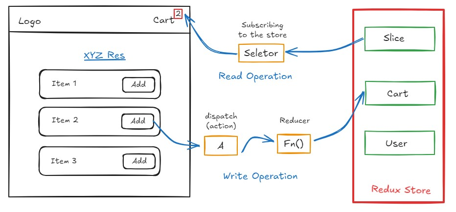

# Redux
- Redux is a data management library that can be used with any UI library or framework, including React.
- Redux & React are both different libraries, Redux is a state management library, while React is a UI library.
- Other libraries like Zustand, MobX, Recoil, etc. can also be used for state management.
### need?
- Redux is not mandatory for React. If you are building small or even mid size applications, you don't need Redux, but if you are building a large application, Where lot of read & write opearations done between components then you should consider using Redux.

- **Redux provides 2 Libararies:**
    - React-Redux: Official library for React bindings(Vanilla Redux).
    - Redux-Toolkit: Redux improve self in world of modern React. Redux toolkit help to address 3 common problems about Redux.
        - Configuring a Redux store is too complicated.
        - I have to add a lot of packages to get Redux to do anything useful.
        - Redux requires too much boilerplate code.
- Read more about [Redux Toolkit](https://redux-toolkit.js.org/)

## Redux Store
- It is big whole JavaScript object that conatains lot of data inside it and it is kept in a central global place.
- The Redux store is the heart of the Redux application. It is a single source of truth for the state of the application.
- The store have small portions that known as **`Slice`**. There can be lot of slices in a store, and these slices can be empty or can have data.
### Operations inside the Redux Store
- **`Write Operation`**: We can't directly write data to the store, here we have a way to write, Suppose we want to built a feature to add items in the cart, then we have to dispatch an action to the store, and then the store will update the data. When we click on add button, it dispatches an action to the store, and it call a function and this function internally modify the cart slice. These functions are known as **`Reducer`**.

- **`Read Operation`**: For reading operation, we use `useSelector` hook, which is provided by `react-redux` library. It read the data from the Redux store and give the data to the component and update the UI. This phonomena is known as **`Subscribing to Store`**, Means it sync the data between store and component. If data changes in store then it automatically update the component.

- See the below Image for better understanding of Redux Store

## Step to use Redux in React
- Install Libraries
- Build the Redux Store
- Connect the Redux Store to the React App
- Create Slices & add to the Store
- Dispatch Actions
- Subscribe to the Store