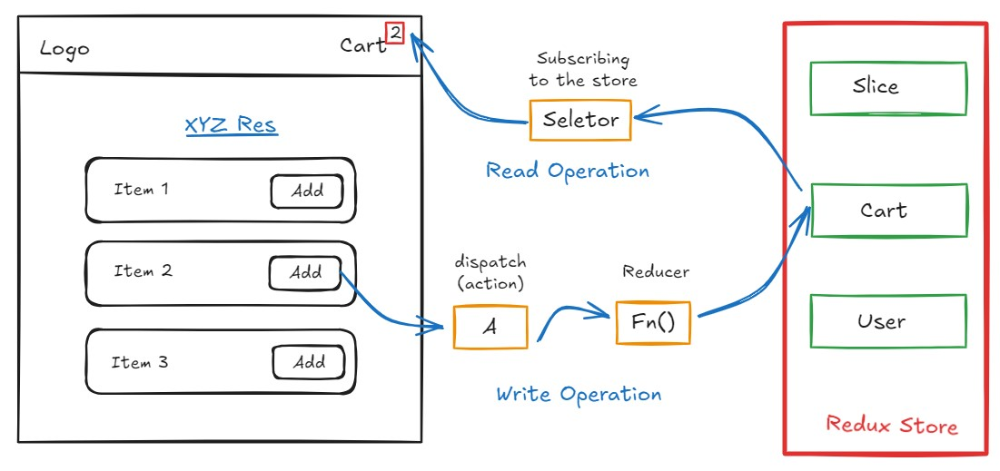

# Redux 
- Redux is a `data management library` that can be used with any `UI library` or `framework`, including React.
- ``Redux` & `React` are both different libraries, Redux is a `state management library`, while React is a `UI library`.
- Other libraries like `Zustand`, `MobX`, `Recoil`, etc. can also be used for state management.
### need?
- Redux is `not` mandatory for React. If you are building `small` or even `mid size` applications, you don't need Redux, but if you are building a `large application`, Where lot of `read` & `write` opearations done between components then you should consider using Redux.

- **Redux provides 2 Libararies:**
    - **React-Redux**: Official library for React bindings(`Vanilla Redux`).
    - **Redux-Toolkit**: Redux improve self in world of modern React. Redux toolkit help to address `3 common` problems about Redux.
        - Configuring a Redux store is too complicated.
        - I have to add a lot of packages to get Redux to do anything useful.
        - Redux requires too much boilerplate code.
- _Read more about_ [Redux Toolkit](https://redux-toolkit.js.org/)

## Redux Store
- It is `big whole JavaScript object` that conatains lot of data inside it and it is kept in a `central global place`.
- The Redux store is the `heart` of the Redux application. It is a single source of truth for the state of the application.
- The store have `small portions` that known as **`Slice`**. There can be lot of slices in a store, and these slices can be `empty` or can have data.
### Operations inside the Redux Store
- **`Write Operation`**: We can't directly write data to the store, here we have a way to write, Suppose we want to built a feature to `add items` in the cart, then we have to **dispatch an action** to the store, and then the store will update the data. When we click on add button, it dispatches an action to the store, and it call a function and this function internally modify the cart slice. These functions are known as **`Reducer`**.

- **`Read Operation`**: For reading operation, we use `useSelector` hook, which is provided by `react-redux` library. It read the data from the Redux store and give the data to the component and update the UI. This `phonomena` is known as **`Subscribing to Store`**, Means it `sync` the data between store and component. If data changes in store then it automatically update the component.

- _See the below Image for better understanding of Redux Store_


## Step to use Redux in React
- Install Libraries
- Build the Redux Store
- Connect the Redux Store to the React App
- Create Slices & add to the Store
- Dispatch Actions
- Subscribe to the Store

### 1. Installing the Redux Library
Just `run` following commands in the terminal
```terminal
npm install @reduxjs/toolkit react-redux
```

### 2. Building the Redux Store
- Create a folder named `store` in the `src` folder.
- Create a file named `store.js` in the `store` folder.
- Use the `cinfigureStore` function from `@reduxjs/toolkit` to create the store.
```JS
import { configureStore } from '@reduxjs/toolkit';

const appStore = configureStore();

export default appStore;
```
### 3. Connecting the Redux Store to the React App
- Wrap the `App` component with the `Provider` component from `react-redux`.
- Pass the `store` prop to the `Provider` component.
- If you want to provide the store to a small portion just `wrap` that portion with `Provider` component.
```JS
import { Provider } from 'react-redux';
import store from './store/store';

const App = () => {
    return (
        <Provider store={store}>
            <div className="App">
                <h1>Redux Store</h1>
            </div>
        </Provider>
    );
}
```
### 4. Creating Slices & Adding to the Store
- Create a folder named `slices` in the `store` folder.
- Create a file named `cartSlice.js` in the `slices` folder.
- Create a slice using the `createSlice` function from `@reduxjs/toolkit`.
- `createSlice` function takes an configuration object as an argument with 3 properties: `name`, `initialState`, and `reducers`.
- `name` is the name of the slice.
- `initialState` is the initial state of the slice.
- `reducers` also an object where all type of actions(_like small APIs to communicate to redux store_) are defined.
- Reducers functions are take `2 arguments` as an input, `state` and `action`.
- At the end of we have to export the `actions` and `reducer` from the slice.
```JS
import { createSlice } from "@reduxjs/toolkit";

const cartSlice = createSlice({
    name:"cart",
    initialState:{
        items:[],
    },
    reducers:{
        addItem: (state, action) => {
            state.items.push(action.payload);
        },
        removeItem: (state) => {
            state.items.pop();
        },
        clearCart: (state) => {
            state.items.length = 0;
        }
    }
});

export const {addItem, removeItem, clearCart} = cartSlice.actions;

export default cartSlice.reducer;
```
- Now, we have to add this slice to the store. Store have `own reducer` and consists to all `small reducers` from different slices.
- We have to import the `cartSlice` in the `store.js` file and add it to the `reducer` property of the `configureStore` function.
```JS
import { configureStore } from '@reduxjs/toolkit';
import cartReducer from './cartSlice';

const appStore = configureStore({
    reducer:{
        cart: cartReducer,
    }
});

export default appStore;
```
### 5. Dispatching Actions
- Use the `useDispatch` hook from `react-redux` to dispatch actions to the store.
- It gives a function which takes `actions` as `argument` and these actions also methods that initially defined in the slice. These metheds can also take arguments or not.
- When the item `dispatch`, the redux created an `payload object` internally and it will add items to payload object and it pass to action.
```JS
import { useDispatch } from 'react-redux';
import { addItem, removeItem, clearCart } from '../store/cartSlice';

const ItemList = () =>{
    const dispatch = useDispatch();
    const handleClickItem = () =>{
        dispatch(addItem("Pizza"));
    };
    return {
        <Button onClick={handleClickItem}>
            Add +
        </Button>
    }
}
```
### 6. Subscribing to the Store
- Use the `useSelector` hook from `react-redux` to read data from the store, but need to tells the portion which portion of the store we want to read.
```JS
import { useSelector } from 'react-redux';

const Header = () => {
    const cartItems = useSelector(store => store.cart.items);
    return (
        <header>
            <h1>Cart
                <sup>{items.length}</sup>
            </h1>
        </header>
    );
}
```
## Some other important things
- Whenever you use `Selector`, Make Sure you are subscribing the `right portion` of the store. If you subscribe whole store then It will be a large `perfomance loss`. So always subscribe the small portion.
```JS
// Don't do this ❌
const store = useSelector(store => store); 
const cartItems = store.cart.items; 

// Do this ✅
const cartItems = useSelector(store => store.cart.items); 
// there both are same thing
```
- **`reducer and recucers`**: When you writing the store you have one big reducer for whole app & it contains multiple small reducers. These small reducers are known as `reducers`. A reducer can be combination of reducers. We exporting by default the `reducer` from the slice.
```JS
export default cartSlice.reducer;
```

## State in Vanilla Redux
- When we will use `vanilla redux`, in older way of redux, there was a big problem with state, redux give clear warning `Don't Mutable State`, this was prohibited. 
- We use to `never modify` our store. Basically, we create a `copy of state` variable and will modify the `newState` variable and `return` it, return is `Mendatory`. This is known as `Immutability`.
```JS
reducers:{
    addItem: (state, action) => {
        const newState = {...state};
        newState.items.push(action.payload);
        return newState;
    }
}
```
- But in `Redux ToolKit`, we have to mutate the state and do not have to return the state. Redux toolkit also `internally` handle the immutability, don't ask to Developer to do it.
```JS
reducers:{
    addItem: (state, action) => {
        state.items.push(action.payload);
    }
}
```
- Redux Toolkit uses `Immer JS` library internally to handle the immutability.
- Immer is a `tiny package` that allows you to work with `immutable state` in a more convenient way.
- Immer find the difference between the `original state` and the `new state` and at the end it will return the new state.
- See the picture below for better understanding of Immer JS.

- Read more about [Immer JS](https://immerjs.github.io/immer/docs/introduction)

- We can't modify states directly because when we try to modify the state is a local variable inside a reducer.
```JS
// Original State = {items: ["Pizza"]}
clearCart: (state) => {
    console.log(state); // {items: ["Pizza"]}
    state = []; // ❌
    console.log(state); // []
}
```
- We try to printing the state but can't print perfectly, to print perfectly use `current()` from `Redux Toolkit`. 
```JS
import { current } from '@reduxjs/toolkit';
clearCart: (state) => {
    console.log(current(state)); // {items: ["Pizza"]}
}
```
Redux Toolkit say either mutable the existing state or return a new state `return {items: []}`.

## Redux DevTools
- It is a `browser extension` that helps to `debug` the redux store.
- If a App have lot of component that `mutating`the state and `subscribing` to the store, then it is very difficult to debug the store. Redux DevTools help to debug the store.
- It shows the state of the `store`, `actions`, and the `changes` in the store.
- It also allows you to `time travel`, means you can go back and forth in the state of the store.
- It also allows you to `export` and `import` the state of the store.
- It also write the `test cases` for the store.
- Install the [Redux DevTools Extension](https://chromewebstore.google.com/detail/redux-devtools/lmhkpmbekcpmknklioeibfkpmmfibljd?hl=en) from the `Chrome Web Store`.
- _See the below image for better understanding of Redux DevTools._


hw
- onClick(fn) vs onClick(fn()) vs onClick={fn} vs onClick={() => fn()}
- RTK Query