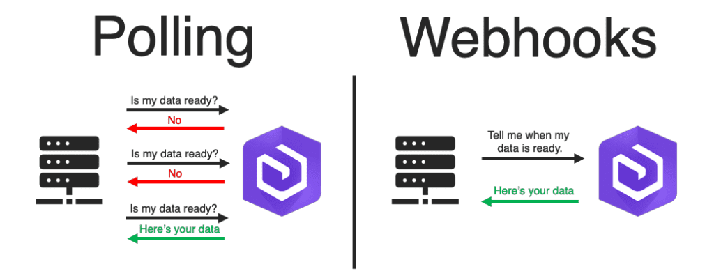

# Project YouTube Clone
In these episodes, I build a YouTube clone. 
- Source code for the project is available at [GitHub](https://github.com/opdsbanasya/OpTube.git)
- In this project, I learned following topics:
    - 👨‍💻 [How to attempt machine coding round](#machine-coding-round) 
    - 🔄 [Higher Order Components](#higher-order-components)
    - ⏳ [Debouncing](#debouncing)
    - 📦 [Cache storage](#cache-storage)
    - 🔁 [Recursion - n level nested comments](#recursion)
    - 💬 [Live Chat](#live-chat) 
    - 🌐 [Web Socket](#web-socket) 
    - 🔄 [API Polling](#api-polling) 

## 👨‍💻 Machine Coding Round
- **Machine coding round** is a coding round where you are given a problem statement and you have to write code to solve the problem.
- The problem statement is generally a real-world problem and you have to write code to solve the problem.

### ✍️ Practices 
- Before start a project following keep in mind:
    - **Understand the problem statement**
    - **Requirement Clarification**
        - Features
        - Tech Stack
            - For example in project, I use `React` for `UI`, `Redux` for `state management`, `React-Router-Dom` for `Routing`, `Tailwind css` for `styling`,` YouTube APIs` for `Data`.
    - Low-level design
        - Do a rough sketch of the project
        - How the project will look like
        - How the project will work

## 🔄 Higher Order Components
Component that takes a component and return a new component with som additional props, state or functionality.
- **Example:** 
    - Video.js
    ```jsx
    const Video  = () => {
        return (
            <div>
                <h1>Video</h1>
            </div>
        )
    }
    ```
    - AdVideo.js
    ```jsx
    const AdVideo = (Video) => {
        return (
            <div>
                <h1>AdVideo</h1>
                <Video />
            </div>
        )
    }
    ```

### 🤔 Need of Higher Order Components 
Suppose you have a that contains some User Cards, Now you want to add label for premium users, Then You can do this easily by Higher Order Components, There no need to create new Component or code changes.

- UserCard.js
```js
const UserCard = () => {
    return <div>
        <h1>{name}</h1>
    </div>
}
```
- PremiumUserCard.js
```js
const PremiumUserCard = (UserCard) => {
    return <div>
        <h3>Premium</h3>
        <UserCard /> 
    </div>
}
```
- Users.js
```js
const Users = () => {
    return isPrimium ? <PremiumUserCard />:<UserCard />
}
```

## ⏳ Debouncing
- When you are doing events very fast than webs skip some events, this phenomenon known as `Debouncing`
- **For example**, when you type in search bar to search slowly, there API calls make with every key stroke and give suggestions to you. Other hand you type very fast, it skip API calls for some key strokes.
- There are number of API calls is then length of search query because difference between 2 keys trikes very less than those are skips.
- If there are call API for intermidiate result, it does not make sense becuase you are typing fast and you don't need suggestions.
- **Debouncing with 200ms**: If difference between 2 key strokes is 200ms:
    - `<200`: Decline API call
    - `>200`: Make API call
- **Example:**

```js
useEffect(()=>{
    const timer = setTimeOut(()=> {
        getSearchSuggestions()
    }, 200)

    return ()=>{
        clearTimeOut(timer);
    }
},[searchQuery])
```

- ⚒️ **Working** 
    - key: i
        - component rendering
        - start timer => make api call after 200ms
    - key: ip
        - destroy the component (useEffect return the method)
        - re-render the component
        - useEffect() called
        - start timer => make api call after 200ms 

## 📦 Cache storage
- If you store results in cache memory, does not need to make API call.
- There I use `Redux` to cache, create a slice, add it to store.
- Add result of every API call to cache, and if user again do same query fetch from here, if query is not there than make API call.
- Set a limit of number of queries for cache, otherwise it can slow your app.
- **Example:**

```js
if(cacheSearch[searchQuery]){
    setSuggetions(cacheSearch[searchQuery]);
} else{
    // make API call
}
```

### LRU

## 🔁 Recursion
When a component called inside self, known as Recursion.
- Example:
```js
const Component = () => {
    return <div>
        <p>Comment</p>
        <p>Replies</p>
        <Component />
    </div>
}
```

## 💬 Live Chat
- Live Chat >> Infinite scrolling >> pagination
- **Example:**
    - When user scroll to bottom, fetch more messages from server.
    - When user scroll to top, fetch more messages from server.
    - When user send message, add to chat box.
- **Challenges:**
    - Get live data : Data layer
    - Update UI : UI layer
- To handle live data following methods are used:
    - Web Socket
    - API Polling

### 🌐 Web Socket
- It is a 2 way connection between client and server, kind of handshake between client and server.
- When you set handshake, you can share data quickly both side.
- Initial connection can take time, but after that data transfer is very fast.
- In web socket connection, there is no regular interval.

### 🔄 API Polling
UI requets to server, but data flow is one way server to client. After an interval, UI polling data, i.e. chech after an interval wheather new data coming or not, known as API Polling.
- _See the image below:_
    

### Example
- Suppose you are developing a mail app. In this case, There is no need to quick response, if data is coming after 10 - 20 seconds, it is fine. There consider to use `API Polling` instead of `Web socket` becuase web socket connections are heavy.
- In the other hand, you are developing a stock market app, there is need to quick response, becuase every milisecond you need to update data, there graph can go up or down. In case of stock things can change in miliseconds, there consider to use `Web Socket`.
- Same as in case of chatting apps like WhatsApp, there very time critical. Suppose you are typing very fast than the order of messages can changes in case of `API polling`. It can make mistakes, so use `Web Socket` in this case.
- Now i come on Live Chat, there is no need to quick response and order, so use `API Polling` in this case. The time interval is around 1.5 seconds.

### There are huge number of API requests, but page is not freezing, why?
**Ans.** This happen because as soon as messages explored from a certain number like 100 or 200 messages, it quickly delete the messages from the top. The number can be different for different devices, depends on system and browser. So, the number of messages in the chat box is constant, so it does not freeze.